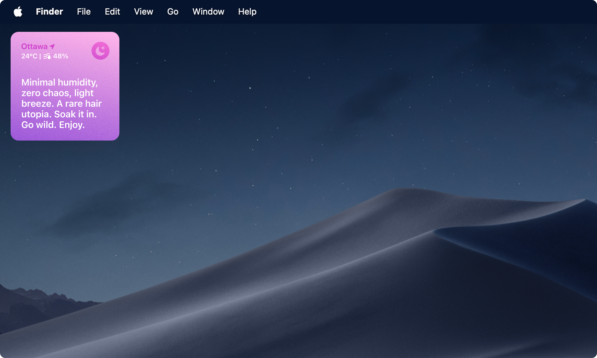

## Hair Weather

An experimental widget that turns live weather data into a one-line hair forecast. Built with vanilla HTML, CSS and JS, using Open-Meteo for weather data and a small rules engine with a hand-edited line bank.



**Demo:** https://veronicaandrd.github.io/frizzy/

### What it does

Takes current weather for your location (or any city), classifies it into a "hair state", and shows a short line plus the temperature and the most relevant second condition. 

### How it works

```
fetch weather -> normalize -> classify (rules) -> pick a line -> render
```

- **Rules engine:** an ordered list of tests. The first match wins, so order is priority.
- **Line bank:** each state owns a set of lines with placeholders like `{city}`, `{t}`, `{rh}`, `{wind}`.
- No LLM at runtime, no API keys, no build step.

### Project structure

| File | What to edit |
|---|---|
| `js/rules.js` | Thresholds (`T`), rule order and each rule's second condition and gradient |
| `js/lines.js` | The line bank, plus `FOG_NOTES` |
| `js/engine.js` | Weather fetch, icon mapping (`SKY_GROUPS`), rendering, dragging |
| `css/styles.css` | Styling, including the noise texture (`.card::before`) |
| `index.html` | Markup and the tuning panel |
| `images/` | Weather icons, small icons, background |

Every rule `id` in `rules.js` needs a matching array in `lines.js`.

### Tuning panel

The bottom-right panel lets you search another city, force any state to preview its copy and colors, and see the raw values behind the current result.

## Credits and data

- Weather data by [Open-Meteo.com](https://open-meteo.com/) (free for non-commercial use; attribution required).
- City name lookup uses a free reverse-geocoding service.
